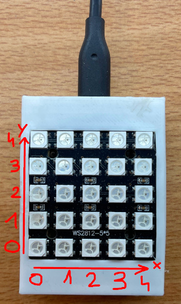

# neopixel_ble_controller

This firmware controlls an ESP32 with a 5x5 Neopixel (ws2812) grid.

The goal of this device is to be used as a testing BLE peripheral.

A picture of the ESP32 and the grid in a 3D printed case:\



## Requirements
- [Install ESP-IDF](https://docs.espressif.com/projects/esp-idf/en/stable/esp32/get-started/index.html)

## Get started

Build
```
$ make
```
Flash
```
make flash
```

## Ble services and characteristics

There is one service with two characteristics, one for sending commands and the other for reading the grid colors.

### Service UUID: 
UUID: **8e72bbe5-f777-5284-7849-b4a0b2ac70d2**

### Characteristic for sending commands:
UUID: **0000beb6-0000-1000-8000-00805f9b34fb**

#### Commands

- **0x01** => clear the grid

- **0x02**[x][y][r][g][b] => set a pixel color

    example: 
    ```c
    uint8_t payload[] = {0x02, 0x02, 0x02, 0xff, 0x00, 0x50};
    // send payload

    // Will set the color of the pixel at x=2 and y=2 to color 0xff0050
    ```

- **0x03**[r][g][b] => set the color of all the pixels (same color for all pixels)

    example:
    ```c
    uint8_t payload[] = {0x03, 0xff, 0x00, 0x00};
    // send payload

    // Will set the color of all the pixels to color 0xff0000
    ```

- **0x04**{[r][g][b], ... * 25} => set the color of all the pixels one by one

    example:
    ```c
    uint8_t payload[] = {0x04, 0xff, 0x00, 0xff, 0x00, 0xff, 0x50 /*...*/};
    // send payload

    // Will set the first pixel to 0xff00ff the second to 0x00ff50 and so on ...
    ```

- **0x05**[brightness] => set the brightness of all the pixels

    The brightness must go from 1 to 20.

    example
    ```c
    uint8_t payload[] = {0x05, 0x01};
    // send payload

    // Will set the brightness to 1 (the lowest brightness)
    ```

- **0x06** => turn on the leds

- **0x07** => turn off the leds


### Characteristic for reading pixels color:
UUID: **0000cad8-0000-1000-8000-00805f9b34fb**

The colors will be arranged like this

```c
typedef struct {
    uint8_t r;
    uint8_t g;
    uint8_t b;
} rgb_color_t;

rgb_color_t the_array_you_receive[25];
```